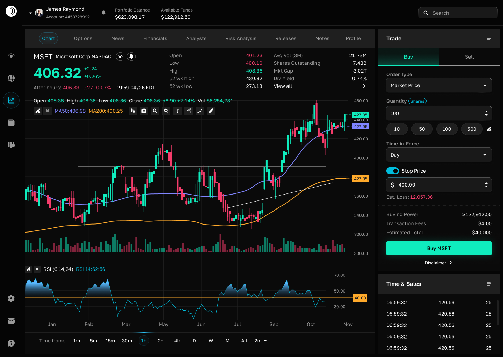

# Stock Trading Dashboard

A responsive stock trading dashboard with HTML5, Tailwind CSS, and JavaScript.



## ✨ Key Features

- **Real-time Stock Chart**: Interactive TradingView widget
- **Trading Panel**: Complete buy/sell interface with order configuration
- **Stock Information**: Live price data and market statistics
- **Responsive Design**: Optimized for desktop and tablet devices
- **Accessibility**: WCAG-compliant with ARIA attributes

## 🛠 Technologies

- **HTML5** with semantic markup
- **Tailwind CSS** via CDN
- **JavaScript** with TradingView integration
- **Custom Fonts**: Golos Text

## 📁 Project Structure

```
trading-dashboard/
├── assets/           # Fonts and images
├── scripts/          # JavaScript functionality
├── styles/           # CSS styles
└── index.html        # Main dashboard page
```

## 🚀 Getting Started

### Prerequisites
- Modern web browser (Chrome, Firefox, Safari, Edge)

### Installation
1. Clone the repository
2. Open `index.html` in your browser
3. No build process required

## 🎨 Design

- **Colors**: Dark background (#050505), Panels (#1F1F1F), Accents (Green, Red, Blue)
- **Typography**: Golos Text with system sans-serif fallbacks
- **Responsive**: Desktop (1440px+) and Tablet (1280px) layouts

## 🔧 Implementation Highlights

- **Component-based** structure with sidebar, trading panel, and chart areas
- **Accessibility** features with semantic HTML and ARIA attributes
- **Performance** optimizations with efficient CSS and SVG assets

## 👤 Author

**Elza Sharapova**
- GitHub: [@ElzaSharapova24](https://github.com/ElzaSharapova24/ElzaSharapova24)
- Email: sharliz1202@gmail.com
- Telegram: [@elzana24](https://t.me/elzana24)
